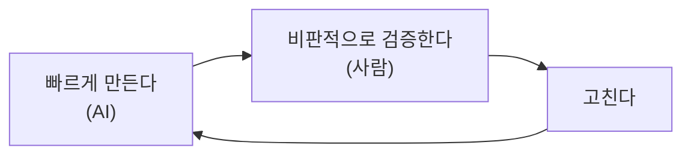

# 모듈 01 — AI 시대, 개발자로 살아남는 법

> **포커스**: 대체되지 않는 역량과 AI 활용 전략
> **예상 기간**: 2\~3일 (오리엔테이션)
> **형식**: 강의 + 성장 계획서 작성 (코드 없음)
> **선행 모듈**: 00 AI 시대, 왜 취업이 어려운가

> 📖 **처음 보는 용어가 있나요?** 이 과정에서 쓰는 핵심 용어는 [용어집](../../../glossary.md)에 정리해 두었습니다. 막히는 단어가 나오면 먼저 찾아보세요.

앞 모듈에서 현실을 직시했다면, 이제 그 위기의식을 **실행 가능한 전략**으로 바꿀 차례입니다. 불안은 그 자체로는 아무것도 바꾸지 못하지만, 방향이 생기면 동력이 됩니다. 이 모듈의 목적은 단 하나, 앞으로 이어질 모든 학습을 "왜 하는지" 분명히 알고 임하게 만드는 것입니다.

---

## 🎯 이 모듈을 마치면

AI를 대체재가 아니라 증폭기로 쓰는 자기만의 원칙을 세우고, AI 시대에도 대체되지 않는 핵심 역량이 무엇인지 이해하며, 그에 맞는 학습법을 익히고, 12주 뒤의 자신을 향한 성장 계획서를 직접 써 내려갈 수 있게 됩니다.

---

## 📚 본문

### AI를 증폭기로 — 판단은 사람의 몫

가장 먼저 바로잡아야 할 태도가 있습니다. AI를 나를 대체할 위협으로 여기느냐, 나를 몇 배로 키워 줄 도구로 여기느냐 하는 것입니다. 현명한 개발자는 AI 코딩 도구(예: Claude Code 같은)를 **페어 프로그래머**처럼 곁에 둡니다. 단조롭고 빠른 작업은 AI에게 맡기고, 자신은 더 중요한 판단에 집중하지요. 다만 한 가지 선은 분명합니다. **검증과 판단, 그리고 결과에 대한 책임은 언제나 사람의 몫**이라는 것입니다. AI의 답을 그대로 믿지 않고, "빠르게 만들고(AI) → 비판적으로 검증하고(사람) → 고친다"를 반복하는 리듬이 AI 시대의 일하는 방식입니다.

### 대체되지 않는 네 가지 역량

그렇다면 무엇을 키워야 할까요? AI가 흉내 내기 어려운 능력은 크게 넷입니다. 첫째는 **문제 정의력**으로, 무엇을 풀지 정하는 능력입니다. AI는 시키는 것을 할 뿐, 무엇을 시켜야 하는지는 사람이 정합니다. 둘째는 **데이터·도메인 이해**입니다. 회사 고유의 맥락은 일반적인 AI가 알 수 없는 영역입니다. 셋째는 **시스템 설계와 디버깅**으로, 전체 그림을 잡고 문제의 원인을 끝까지 추적하는 능력입니다. 넷째는 **커뮤니케이션과 협업**입니다. Git과 PR, 코드 리뷰를 통해 다른 사람과 함께 일하는 능력은 기술만큼이나 중요합니다.

### T자형 인재 — 넓게 딛고 깊게 파기

이 역량들을 한 그림으로 그리면 알파벳 T가 됩니다. 가로획은 Linux·Git·Python·SQL·데이터를 아우르는 **넓은 기초**이고, 세로획은 그중 하나를 깊이 파고든 **전문성**, 즉 데이터 엔지니어링입니다. 넓기만 하면 깊이가 없고, 깊기만 하면 시야가 좁습니다. 이 교육은 정확히 이 T자 — 넓은 기초 위에 데이터 엔지니어링이라는 깊은 축 — 를 만들도록 설계되어 있습니다.

### AI 시대의 학습법

도구가 바뀌면 배우는 방식도 바뀌어야 합니다. 답을 통째로 외우는 공부는 AI 시대에 가장 쓸모가 없습니다. 대신 **"왜"를 묻는 습관**이 중요합니다. 왜 이렇게 동작하는지, 왜 이 방법이 더 나은지를 따져 묻는 사람만이 AI의 답을 비판적으로 검증할 수 있습니다. AI가 그럴듯하지만 틀린 답(환각)을 내놓을 때 그것을 걸러 내는 힘이 바로 여기서 나옵니다. 또한 머릿속으로만 고민하기보다 빠르게 만들어 보고 고치며 배우고, 그렇게 배운 것을 GitHub에 기록해 "AI가 아니라 내가 직접 거친 사고 과정"을 남기는 것이 좋습니다.

### 포트폴리오 — 기록의 힘

마지막으로 강조하고 싶은 것은 기록의 힘입니다. 여러분이 만든 코드와 프로젝트, 분석 리포트를 GitHub에 차곡차곡 남기면, 그 자체가 살아 있는 포트폴리오가 됩니다. 깔끔하게 쌓인 커밋 이력은 꾸준함과 사고 과정을 증명하는 증거입니다. 다행히 이 교육의 모든 실습과 프로젝트는 그대로 포트폴리오가 되도록 설계되어 있으니, 처음부터 "남긴다"는 마음으로 임하면 과정이 곧 결과물이 됩니다.

---

## 🛠 활동으로 익히기

이 모듈의 활동은 **개인 성장 계획서**(`worksheet/growth-plan.md`)를 쓰는 것입니다. 12주 뒤의 목표, AI를 어디까지 쓰고 무엇은 직접 검증할지에 대한 원칙, 그리고 포트폴리오 계획을 구체적으로 적어 봅니다. 이 계획서는 그냥 한 번 쓰고 잊는 문서가 아닙니다. 마지막 모듈 15(미니 프로젝트)에서 다시 꺼내, 처음의 다짐을 얼마나 지켰는지 돌아보는 거울이 됩니다.

---

## ✅ 완료 기준 (체크리스트)
- [ ] AI를 증폭기로 쓰는 원칙을 한 문장으로 말할 수 있다
- [ ] 대체되지 않는 역량 4가지를 설명할 수 있다
- [ ] AI 시대 학습법의 핵심(왜 묻기·검증·기록)을 안다
- [ ] `worksheet/growth-plan.md`를 작성했다

## 📂 폴더 구성
- `worksheet/` — 개인 성장 계획서 양식

## 🔗 참고 자료
- 다음 모듈([02 — 데이터 엔지니어란?](../02-what-is-data-engineer/))에서 구체적인 직무로 들어갑니다.
- 마지막 [15 — 미니 프로젝트](../15-mini-project/)에서 이 계획서로 회고합니다.
