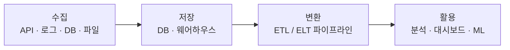

# 모듈 02 — 데이터 엔지니어란?

> **포커스**: DE 직무 소개, 데이터 흐름의 큰 그림, 학습 로드맵
> **예상 기간**: 2~3일 (오리엔테이션)
> **형식**: 강의 + 데이터 흐름 지도 그리기 (코드 없음)
> **선행 모듈**: 00~01

본격적으로 도구를 만지기 전에, 우리가 무엇이 되려 하는지부터 분명히 해 둡시다. 데이터 엔지니어는 실제로 무슨 일을 하는 사람일까요? 그리고 앞으로 배울 Linux, Git, Python, SQL, pandas 같은 것들은 그 일의 전체 그림에서 어디쯤에 놓이는 걸까요? 이 모듈에서는 데이터가 흐르는 큰 지도를 먼저 그려, 이후의 모든 학습이 그 지도 위 어디를 채우는 작업인지 알고 시작하도록 합니다.

---

## 🎯 이 모듈을 마치면

데이터 엔지니어의 역할과 다른 데이터 직군의 차이를 설명하고, 데이터가 수집에서 활용까지 흐르는 큰 그림을 이해하며, 이 교육의 각 모듈이 그 그림의 어느 부분에 해당하는지 연결할 수 있게 됩니다.

---

## 📚 본문

### 데이터를 둘러싼 직군들

데이터를 다루는 일에는 여러 역할이 있고, 그 경계가 처음에는 헷갈립니다. 간단히 정리하면 다음과 같습니다.

| 직군 | 한 줄 역할 |
|------|-----------|
| **데이터 엔지니어 (DE)** | 데이터를 **모으고·옮기고·다듬는 파이프라인**을 만든다 |
| 데이터 분석가 (DA) | 데이터로 **질문에 답하고 인사이트**를 낸다 |
| 데이터 과학자 (DS) | 데이터로 **모델·예측**을 만든다 |
| ML 엔지니어 | 모델을 **서비스로 배포·운영**한다 |

여기서 데이터 엔지니어의 자리를 한마디로 말하면, **다른 모든 직군이 신뢰할 수 있는 데이터를 쓸 수 있도록 토대를 놓는 사람**입니다. 분석가가 좋은 인사이트를 내고 과학자가 좋은 모델을 만들 수 있는 것은, 그 뒤에서 누군가 데이터를 제때, 빠짐없이, 깨끗하게 흘려보내 주기 때문입니다. 그 누군가가 바로 데이터 엔지니어입니다.

### 데이터가 흐르는 큰 그림

데이터 엔지니어링의 전체를 한 장의 그림으로 그리면 이렇게 됩니다.

가장 먼저, 여기저기 흩어진 소스 — API, 로그, 데이터베이스, 파일 — 에서 데이터를 **가져옵니다(수집/Extract)**. 가져온 데이터는 데이터베이스나 웨어하우스에 **쌓고(저장/Load)**, 정제하고 집계해 쓸 수 있는 형태로 **다듬습니다(변환/Transform)**. 그렇게 준비된 데이터를 분석가와 과학자, 그리고 서비스가 **활용**합니다. 데이터 엔지니어의 일은 바로 이 흐름 전체가 끊김 없이, 믿을 수 있게 돌아가도록 만드는 것입니다.

### 매일 쓰는 도구가 곧 이 교육의 내용

이 큰 그림을 실제로 굴리려면 여러 도구가 필요한데, 놀랍게도 그것들이 이 교육의 모듈과 그대로 맞아떨어집니다.

| 영역 | 도구 | 이 교육 모듈 |
|------|------|--------------|
| 운영체제·환경 | 터미널, Linux, Docker | 03, 05, 12 |
| 문서화 | Markdown | 04 |
| 협업 | Git/GitHub | 06 |
| 프로그래밍 | Python | 07, 08, 09 |
| 데이터 질의 | SQL | 10, 11 |
| 데이터 가공 | pandas | 13 |
| 분석·전달 | EDA, 시각화 | 14 |
| 종합 | 미니 프로젝트 | 15 |

다시 말해, 앞으로 만나는 모든 모듈은 "데이터 흐름을 만드는 사람"이 되기 위한 조각들입니다. 지금 당장은 각 조각이 따로 노는 것처럼 느껴지더라도, 마지막 미니 프로젝트에서 이 조각들이 하나로 맞물리는 순간을 경험하게 될 것입니다.

### 신입 데이터 엔지니어의 하루

조금 더 실감 나게, 신입 데이터 엔지니어의 하루를 상상해 봅시다. 아침에 출근하면 먼저 어젯밤 파이프라인이 무사히 돌았는지 로그를 살핍니다(Linux, 모듈 05). 데이터가 어딘가 이상하면 SQL로 원인을 추적하고(모듈 10~11), 새로운 데이터 소스를 붙이는 코드를 짜서 PR을 올립니다(Python·Git, 모듈 06~09). 오후에는 분석가의 요청에 맞춰 데이터를 정제해 넘깁니다(pandas, 모듈 13). 이 하루 속에 등장하는 도구들이 전부 이 교육의 모듈이라는 점을 눈여겨보세요. 우리는 지금, 이 하루를 살아갈 준비를 하고 있는 것입니다.

---

## 🛠 활동으로 익히기

이 모듈의 활동은 **데이터 흐름 지도 그리기**(`worksheet/data-flow-map.md`)입니다. 배달앱이나 음악앱처럼 익숙한 서비스 하나를 골라, 그 안에서 데이터가 수집→저장→처리→활용으로 어떻게 흐를지 직접 그려 봅니다. 정답을 맞히는 활동이 아니라, 일상의 서비스를 "데이터의 눈"으로 바라보는 연습입니다.

---

## ✅ 완료 기준 (체크리스트)
- [ ] DE와 DA/DS의 차이를 설명할 수 있다
- [ ] 데이터 흐름의 4단계(수집→저장→변환→활용)를 말할 수 있다
- [ ] 이 교육의 모듈들이 그림 어디에 위치하는지 연결할 수 있다
- [ ] `worksheet/data-flow-map.md`를 작성했다

## 📂 폴더 구성
- `worksheet/` — 데이터 흐름 지도 양식

## 🔗 참고 자료
- 다음 모듈([03 — 개발 환경 & 터미널](../03-dev-environment-terminal/))부터 실제 도구를 설치하고 만지기 시작합니다.
