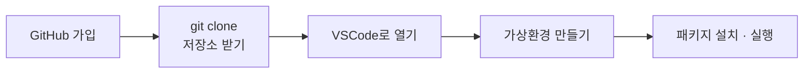

# 모듈 03 — 개발 환경 & 터미널

> **포커스**: 터미널/쉘, VSCode, Python 환경(uv/venv), 패키지 관리
> **예상 기간**: 1주
> **선행 모듈**: 02 (오리엔테이션)

코드를 한 줄 쓰기 전에 먼저 갖춰야 할 것이 있습니다. 바로 **개발자처럼 일할 수 있는 환경**입니다. 터미널을 열어 명령을 내리고, 코드 에디터로 파일을 편집하고, Python 가상환경을 만들어 패키지를 설치하고, 작성한 스크립트를 실행하는 것 — 이 일련의 흐름이 앞으로 이어질 모든 실습의 출발점입니다. 이 모듈을 마치면 이후 어떤 모듈이든 바로 따라올 준비가 됩니다.

> 💡 운영체제에 따라: macOS와 Linux는 기본 터미널을, Windows는 **WSL2 + Ubuntu**를 권장합니다.

---

## 🎯 이 모듈을 마치면

GitHub 계정을 만들어 이 교육 저장소를 내 컴퓨터로 받아 오고, 터미널로 기본적인 이동과 확인을 하며, VSCode로 코드를 편집하고, `uv`(또는 venv)로 가상환경을 만들어 패키지를 설치하고 스크립트를 실행하며, 무엇보다 가상환경이 왜 필요한지를 설명할 수 있게 됩니다.

---

## 📚 본문

### 가장 먼저 — GitHub 가입과 저장소 받기 🚀

이 교육의 모든 자료는 GitHub 저장소에 담겨 있습니다. 그러니 첫걸음은 **계정을 만들고 그 저장소를 내 컴퓨터로 복제(clone)**하는 것입니다. Git을 본격적으로 다루는 법은 모듈 06에서 따로 배우니, 여기서는 "자료를 내 PC로 받아 온다"는 목표에만 집중하면 됩니다. 아래 네 단계를 차례로 따라오세요.



**① GitHub 계정 만들기**
1. [github.com](https://github.com/)에 접속해 **Sign up**을 누릅니다.
2. 이메일·비밀번호·사용자명(username)을 입력하고 이메일 인증을 마칩니다.
3. 학생이라면 [GitHub 학생 혜택(Student Developer Pack)](https://education.github.com/pack)도 신청해 두면 여러 도구를 무료로 쓸 수 있습니다.

**② Git이 깔려 있는지 확인**
```bash
git --version        # 버전이 안 나오면 설치가 필요합니다
```
설치가 필요하면, macOS는 `xcode-select --install`이나 [git-scm.com](https://git-scm.com/)에서, Windows는 [git-scm.com](https://git-scm.com/)의 Git for Windows(Git Bash 포함)로, Linux(Ubuntu)는 `sudo apt install git`으로 설치합니다.

**③ 저장소 clone(복제)하기**
저장소 페이지에서 초록색 **Code** 버튼을 눌러 HTTPS 주소를 복사한 뒤, 터미널에서 받습니다.
```bash
cd ~                 # 받을 위치로 이동 (예: 홈 디렉토리)
git clone https://github.com/DataDynamics/intern-edu.git
cd intern-edu        # 복제된 폴더로 이동
ls                   # 트랙·모듈 파일이 보이면 성공!
```
여기서 clone이란 원격 저장소 전체를 내 컴퓨터로 **통째로 복사해 오는 것**을 말합니다. 이후 강사가 자료를 업데이트하면 `git pull` 한 줄로 최신 내용을 받아올 수 있습니다(모듈 06에서 자세히).

**④ VSCode로 열기**
```bash
code .               # 현재 폴더(intern-edu)를 VSCode로 열기
```

> 회사 계정, 조직 저장소, SSH 키 설정 같은 세부 정책은 강사의 안내를 따르세요.

### 터미널과 쉘

터미널은 명령어로 컴퓨터에 일을 시키는 창이고, 그 명령을 해석해 실행하는 프로그램을 쉘(shell)이라 합니다. 흔히 쓰는 쉘로는 bash와 zsh가 있습니다. 처음에는 검은 화면이 낯설지만, 자주 쓰는 명령은 몇 개 되지 않습니다. 지금 어디에 있는지 보는 `pwd`, 파일 목록을 보는 `ls`, 디렉토리를 옮기는 `cd`, 화면을 정리하는 `clear` 정도면 시작하기에 충분합니다. 더 깊은 명령은 모듈 05에서 본격적으로 다룹니다.

```bash
pwd        # 현재 위치
ls         # 파일 목록
cd 폴더     # 이동
clear      # 화면 지우기
```

### 코드 에디터 — VSCode

코드를 쓰고 다듬는 작업은 코드 에디터에서 합니다. 우리는 무료이면서 강력한 [VSCode](https://code.visualstudio.com/)를 씁니다. 설치한 뒤에는 Python과 Docker 확장을 더해 두면 좋고, 한글 환경이 편하면 Korean Language Pack도 설치할 수 있습니다. 폴더를 열 때는 메뉴의 `File > Open Folder`를 쓰거나 터미널에서 `code .`를 입력하면 되고, 에디터 안에서 `Ctrl + ~`(백틱)를 누르면 통합 터미널이 열려 코드를 쓰면서 바로 명령을 실행할 수 있습니다.

### Python이 깔려 있는지 확인

이 교육의 주력 언어인 Python이 준비됐는지 확인합니다.
```bash
python --version      # 또는 python3 --version
```
3.10 이상이면 충분합니다. 없다면 [python.org](https://www.python.org/)에서 내려받거나, 뒤에 나올 `uv`로 설치할 수 있습니다.

### 가상환경 — 프로젝트마다 독립된 공간 ⭐

이 모듈에서 가장 중요한 개념이 **가상환경**입니다. 프로젝트마다 패키지를 담는 독립된 공간을 따로 두는 것을 말하는데, 왜 필요할까요? 프로젝트 A는 어떤 라이브러리의 1.0 버전이, 프로젝트 B는 2.0 버전이 필요할 수 있습니다. 모든 것을 한곳에 깔면 둘이 충돌하지요. 가상환경은 각 프로젝트에 자기만의 방을 내어 주어 이런 충돌을 막습니다.

우리는 빠르고 편한 `uv`를 권장합니다. 가상환경을 만들고(`uv venv`), 활성화한 뒤(`source ...`), 그 안에 패키지를 설치합니다(`uv pip install`).

```bash
curl -LsSf https://astral.sh/uv/install.sh | sh   # uv 설치 (macOS/Linux)
uv venv                       # .venv 가상환경 생성
source .venv/bin/activate     # 활성화 (Windows: .venv\Scripts\activate)
uv pip install pandas         # 패키지 설치
```

uv가 없다면 Python에 기본 내장된 venv로도 똑같이 할 수 있습니다(`python -m venv .venv` → 활성화 → `pip install`). 가상환경이 활성화되면 터미널 프롬프트 앞에 `(.venv)`가 표시되어 지금 그 방 안에 있음을 알려 주고, 방에서 나오려면 `deactivate`를 입력합니다.

### 스크립트 실행과 requirements.txt

준비가 끝났다면 코드를 실행해 봅니다. 파일을 통째로 돌리려면 `python hello.py`, 한 줄짜리 코드를 즉석에서 시험하려면 `python -c "print(1+1)"`처럼 씁니다. 마지막으로, 내가 설치한 패키지 목록을 `requirements.txt`라는 파일로 관리하면 **다른 사람도 똑같은 환경을 그대로 재현**할 수 있습니다. `uv pip freeze > requirements.txt`로 현재 목록을 저장하고, `uv pip install -r requirements.txt`로 그 목록대로 한 번에 설치합니다. 이는 모듈 06에서 배울 협업의 정신 — "남도 똑같이 재현하게 하기" — 과 그대로 통합니다.

---

## 🛠 실습으로 익히기

`exercises/`에서, 가상환경을 만들어 활성화한 뒤 **환경 점검 스크립트**(`env_check.py`)를 완성합니다. 현재 Python 버전을 알아내고, 그 버전이 교육 기준(3.10 이상)을 만족하는지 판단하고, 간단한 인사 문구를 돌려주는 세 함수를 채우는 가벼운 과제입니다. 이 스크립트가 정상으로 동작한다면, 여러분의 가상환경과 Python 실행 환경이 제대로 갖춰졌다는 뜻입니다. `python check.py`가 통과하면 완성입니다.

---

## ✅ 완료 기준 (체크리스트)
- [ ] GitHub 계정을 만들었다
- [ ] `git clone`으로 이 교육 저장소를 내 컴퓨터로 받았다
- [ ] 터미널에서 `pwd`/`ls`/`cd`로 이동할 수 있다
- [ ] VSCode로 폴더를 열어 파일을 편집할 수 있다
- [ ] 가상환경을 만들고 활성화/비활성화할 수 있다
- [ ] 가상환경에 패키지를 설치하고 스크립트를 실행했다
- [ ] 가상환경이 왜 필요한지 설명할 수 있다
- [ ] `exercises/`의 `env_check.py`가 `check.py`를 통과한다
- [ ] `assessment/quiz.md`를 모두 풀었다

## 📂 폴더 구성
- `examples/` — 환경 점검 예제 스크립트
- `exercises/starter/` — 완성할 스크립트(TODO) + 자가 검증
- `exercises/solution/` — 정답
- `assessment/` — 퀴즈 + 완료 체크리스트

## 🔗 참고 자료
- [uv 공식 문서](https://docs.astral.sh/uv/)
- [VSCode로 Python 시작하기](https://code.visualstudio.com/docs/python/python-tutorial)
- 다음 모듈 05(Linux 기초)에서 터미널 명령을 본격적으로 다룹니다.
