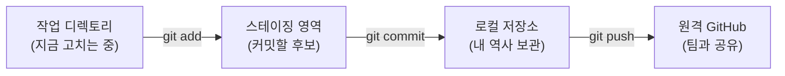
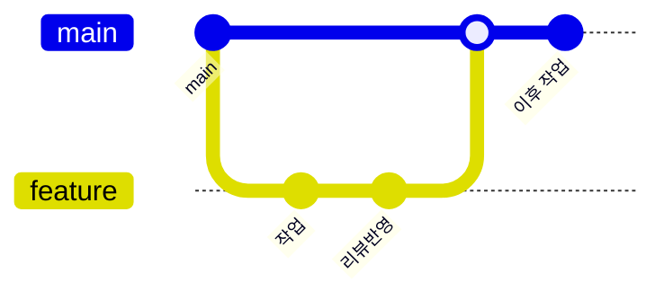

# 모듈 06 — Git & 협업

> **포커스**: 버전 관리의 원리, commit·브랜치·PR, GitHub 협업
> **예상 기간**: 1주
> **선행 모듈**: 05 Linux 기초, 04 Markdown 기초

> 📖 **처음 보는 용어가 있나요?** 이 과정에서 쓰는 핵심 용어는 [용어집](../../../glossary.md)에 정리해 두었습니다. 막히는 단어가 나오면 먼저 찾아보세요.

소프트웨어는 혼자, 한 번에 완성되지 않습니다. 여러 사람이 같은 코드를 며칠, 몇 달에 걸쳐 조금씩 고쳐 나가지요. 이때 "누가, 언제, 무엇을, 왜 바꿨는지"를 기록하지 않으면 금세 혼란에 빠집니다. 파일 이름이 `보고서_최종.py`, `보고서_최종_진짜최종.py`, `보고서_최종_이게진짜.py`로 불어나는 풍경, 한 번쯤 보셨을 겁니다. **Git**은 바로 이 문제를 푸는 도구입니다. 모든 변경을 시간 순서로 기록하고, 필요하면 과거로 되돌리며, 여러 사람의 작업을 충돌 없이 합쳐 줍니다.

그리고 **GitHub**은 그 Git 저장소를 인터넷에 두고 팀과 공유하는 공간입니다. 데이터 엔지니어가 작성하는 파이프라인 코드, SQL, 설정 파일은 거의 예외 없이 Git으로 관리되고 GitHub(또는 GitLab 같은 유사 서비스)에서 리뷰를 거쳐 합쳐집니다. 이 모듈에서는 Git의 작동 원리를 이해하고, 마지막에는 이 교육 저장소에 **실제로 Pull Request를 올리는 것**까지 직접 해 봅니다.

---

## 🎯 이 모듈을 마치면

Git이 변경을 기록하는 방식을 머릿속에 그릴 수 있게 되고, `add → commit → push`라는 기본 흐름을 막힘없이 수행하게 됩니다. 나아가 브랜치를 만들어 독립적으로 작업한 뒤 Pull Request로 동료의 리뷰를 받아 본문(main)에 합치는 협업의 한 사이클을 경험하고, 충돌이 났을 때 당황하지 않고 풀어내는 법까지 익히게 됩니다.

---

## 📚 본문

### Git이 정말로 푸는 문제

Git을 단순한 "백업 도구"로 오해하기 쉽지만, 본질은 **변경의 역사를 다루는 것**입니다. Git은 어느 시점의 코드 상태를 통째로 사진 찍듯 저장하는데, 이 사진 한 장을 **커밋(commit)**이라고 부릅니다. 커밋들이 시간 순으로 쌓여 하나의 역사를 이루고, 우리는 언제든 그 역사를 거슬러 올라가 "3일 전 그 버그가 없던 상태"로 돌아가거나, "이 줄을 누가 왜 바꿨는지" 추적할 수 있습니다. 여러 사람이 동시에 작업할 수 있는 것도, 각자의 역사를 따로 만들었다가 나중에 합치는 방식 덕분입니다.

### 세 개의 공간 — Git을 이해하는 열쇠

Git을 처음 배울 때 가장 헷갈리는 부분이자, 한번 이해하면 모든 것이 풀리는 핵심 개념이 있습니다. 바로 파일이 거쳐 가는 **세 개의 공간**입니다.



여러분이 파일을 편집하는 곳이 **작업 디렉토리**입니다. 여기서 고친 내용은 아직 Git의 역사에 들어가지 않았습니다. `git add`를 하면 그 변경이 **스테이징 영역**으로 올라가는데, 이곳은 "이번 커밋에 포함할 것들을 담아 두는 장바구니"라고 생각하면 됩니다. 장바구니를 다 채운 뒤 `git commit`을 하면, 그 묶음이 하나의 사진(커밋)으로 **로컬 저장소**의 역사에 확정됩니다. 마지막으로 `git push`를 하면 내 컴퓨터의 역사가 GitHub의 **원격 저장소**로 올라가 팀과 공유됩니다.

왜 굳이 스테이징이라는 중간 단계가 있을까요? 한 번에 여러 파일을 고쳤더라도, 그중 의미가 같은 것끼리만 골라 묶어 커밋할 수 있게 하기 위해서입니다. 덕분에 "버그 수정"과 "오타 정정"을 별개의 커밋으로 깔끔하게 나눌 수 있습니다.

### 기본 흐름을 손에 익히기

실제 명령은 단순합니다. 무엇보다 자주 쓰게 될 명령은 현재 상태를 보여 주는 `git status`로, 길을 잃었다 싶을 때마다 이것부터 칩니다.

```bash
git status                 # 지금 어떤 파일이 어느 공간에 있는지 보여 준다
git add data_loader.py     # 특정 파일을 스테이징(장바구니에 담기)
git add .                  # 바뀐 것을 모두 스테이징
git commit -m "Add data loader"   # 장바구니를 하나의 커밋으로 확정
git push                   # 원격으로 올리기
git log --oneline          # 커밋 역사를 한 줄씩 훑어보기
git diff                   # 아직 add하지 않은 변경 내용을 보기
```

`git diff`로 무엇을 바꿨는지 눈으로 확인한 뒤 `add`하고, `git status`로 장바구니를 점검한 뒤 `commit`하는 리듬에 익숙해지면, Git은 더 이상 무서운 도구가 아니게 됩니다.

### 추적하지 않을 파일 — .gitignore

저장소에는 올리면 안 되는 파일들이 있습니다. 비밀번호가 담긴 `.env`, 용량이 큰 데이터 원본, 파이썬이 자동 생성하는 `__pycache__/`, 가상환경 `.venv/` 같은 것들입니다. 이런 파일의 패턴을 `.gitignore`라는 파일에 적어 두면, Git이 아예 추적 대상에서 제외합니다. 비밀이 실수로 공개되거나 저장소가 쓸데없이 무거워지는 사고를 막는 안전장치이므로, 새 프로젝트를 시작할 때 가장 먼저 챙기는 습관을 들이는 것이 좋습니다.

### 좋은 커밋 메시지 — 미래의 나에게 보내는 편지

커밋 메시지는 단순한 형식이 아니라 **협업의 핵심**입니다. 몇 달 뒤 문제가 생겨 역사를 뒤질 때, 잘 쓴 메시지 한 줄이 몇 시간을 아껴 줍니다. 좋은 메시지는 첫 줄에 **무엇을 했는지**를 50자 안팎으로, 명령형(예: "Add", "Fix", "Update")으로 요약합니다. 더 설명할 것이 있으면 한 줄 비우고 본문에 **왜** 그렇게 했는지를 적습니다. 무엇을 바꿨는지는 코드를 보면 알 수 있지만, 왜 그랬는지는 메시지만이 알려 주기 때문입니다.

```
Fix incorrect status-code parsing in log analyzer

로그 포맷이 바뀌면서 awk가 엉뚱한 필드를 읽고 있었다.
상태코드는 항상 9번째 필드이므로 $9로 통일했다.
```

### 브랜치와 PR — 협업이 실제로 굴러가는 방식

여러 사람이 같은 `main`에 직접 커밋하면, 서로의 작업이 뒤엉켜 금세 아수라장이 됩니다. 그래서 현업에서는 거의 예외 없이 **브랜치**를 씁니다. 브랜치는 본문에서 갈라져 나온 **나만의 작업 가지**입니다. 여기서 마음껏 고치고 커밋해도 `main`은 안전하게 유지됩니다.

```bash
git switch -c feature/add-report   # 새 가지를 만들고 그쪽으로 이동 (구버전: git checkout -b)
# ... 코드를 고치고 ...
git add .
git commit -m "Add weekly report script"
git push -u origin feature/add-report   # 내 가지를 원격으로 올린다
```

작업을 마치면 GitHub에서 **Pull Request(PR)**를 엽니다. PR은 "제 가지의 변경을 본문에 합쳐 주세요"라는 공식 요청이자, 동료가 코드를 **리뷰**하고 의견을 남기는 토론의 장입니다. 리뷰에서 받은 지적을 고쳐 다시 push하면 PR에 자동으로 반영되고, 승인되면 비로소 `main`에 합쳐집니다. 합쳐진 뒤에는 본문으로 돌아와 최신 상태를 받아 옵니다.

```bash
git switch main      # 본문으로 복귀
git pull             # 합쳐진 최신 main을 내려받기
```

브랜치가 갈라져 나갔다가 다시 합쳐지는 모습을 그림으로 보면 이렇습니다.



이 한 사이클 — 가지 치기 → 작업 → PR → 리뷰 → 병합 → 동기화 — 이 협업의 기본 박자입니다. 그리고 PR 설명을 잘 쓰는 데에는 바로 앞 모듈에서 배운 **Markdown**이 그대로 쓰입니다.

### 병합과 충돌 — 두려워할 일이 아니다

서로 다른 가지를 합칠 때, Git은 대부분의 경우 알아서 깔끔하게 합쳐 줍니다. 문제는 **두 사람이 같은 파일의 같은 줄을 다르게 고쳤을 때**입니다. 이때 Git은 누구 말이 맞는지 판단할 수 없으므로, 그 부분을 표시해 두고 사람에게 결정을 맡깁니다. 이것이 **충돌(conflict)**입니다.

충돌이 나면 파일 안에 다음과 같은 표시가 생깁니다.

```
<<<<<<< HEAD
내 가지의 내용
=======
상대 가지의 내용
>>>>>>> feature/other
```

당황할 필요 없습니다. `<<<<<<<`, `=======`, `>>>>>>>` 사이를 살펴보고 **남길 내용만 남긴 뒤 이 표시들을 모두 지우면** 됩니다. 그런 다음 평소처럼 `add`하고 `commit`하면 충돌이 해결됩니다. 충돌은 실수가 아니라 협업에서 자연스럽게 일어나는 일이며, 차분히 읽고 고르면 되는 작업입니다.

### 되돌리기 — 실수해도 괜찮다

Git의 가장 큰 미덕은 **거의 모든 실수를 되돌릴 수 있다**는 점입니다. 아직 커밋하지 않은 변경을 버리고 싶으면 `git restore 파일`로 원래대로 되돌리고, 이미 공유한 커밋을 안전하게 취소하고 싶으면 그 커밋의 반대 내용을 새로 만드는 `git revert`를 씁니다. "망쳤다" 싶을 때 검색해 볼 안내서로 [Oh Sh\*t, Git!?!](https://ohshitgit.com/ko)가 유명하니 즐겨찾기 해 두면 든든합니다.

---

## 🛠 실습으로 익히기

`exercises/`의 안내를 따라 이 교육 저장소에 **첫 Pull Request**를 올려 봅니다. 저장소를 받아 자신의 이름으로 브랜치를 만들고, `students/` 폴더에 Markdown으로 자기소개 파일을 추가한 뒤, 커밋하고 push하여 PR을 엽니다. `examples/`의 두 데모 스크립트(`01_basic_flow.sh`, `02_branch_and_merge.sh`)는 임시 저장소에서 add·commit·branch·merge의 흐름을 안전하게 보여 주니, 실습 전에 한 번씩 실행해 눈으로 익혀 두면 좋습니다.

---

## ✅ 완료 기준 (체크리스트)
- [ ] 세 개의 공간(작업/스테이징/저장소)과 그 사이를 잇는 명령을 설명할 수 있다
- [ ] `add → commit → push`를 막힘없이 수행한다
- [ ] `.gitignore`가 왜 필요한지 알고 사용할 수 있다
- [ ] 명령형으로 의미 있는 커밋 메시지를 쓴다
- [ ] 브랜치를 만들어 작업하고 main에 PR을 올렸다
- [ ] 충돌이 무엇이고 어떻게 해결하는지 설명할 수 있다
- [ ] `assessment/quiz.md`를 모두 풀었다

## 📂 폴더 구성
- `examples/` — add/commit/branch/merge 흐름을 보여 주는 데모 스크립트
- `exercises/starter/` — PR 실습 안내 + 자기소개 템플릿
- `exercises/solution/` — 작성 예시
- `assessment/` — 퀴즈 + 완료 체크리스트

## 🔗 참고 자료
- [Pro Git (무료 한국어 책)](https://git-scm.com/book/ko/v2)
- [GitHub Docs — Hello World](https://docs.github.com/ko/get-started/quickstart/hello-world)
- [Oh Sh\*t, Git!?!](https://ohshitgit.com/ko) — 망쳤을 때 복구법
- 다음 모듈 07(Python 기초)에서 실제 코드를 다루기 시작합니다.
