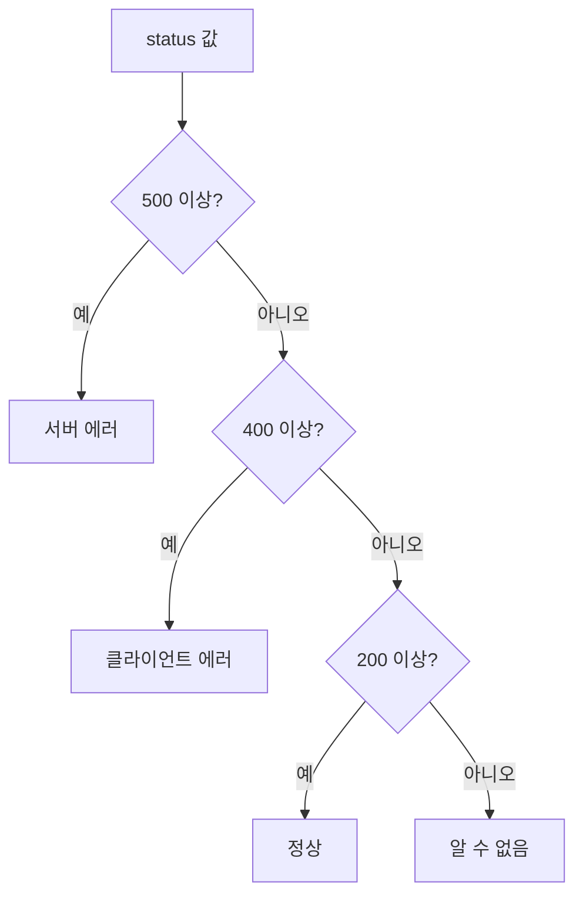

# 모듈 07 — Python 기초 (1)

> **포커스**: 변수·자료형, 연산, 조건문, 반복문
> **예상 기간**: 1주
> **선행 모듈**: 03 개발 환경, 05 Linux

이제 본격적으로 코드를 쓰기 시작합니다. 데이터 엔지니어가 다루는 거의 모든 일 — 데이터를 읽고, 모양을 바꾸고, 검사하고, 다른 곳으로 옮기는 일 — 의 바탕에는 Python이 있습니다. Python은 문장이 사람의 말과 가까워서 입문 언어로 사랑받지만, 동시에 세계에서 가장 큰 데이터·AI 생태계를 가진 실무 언어이기도 합니다. 즉 처음 배우기 쉬운데 끝까지 쓸 수 있는, 흔치 않은 언어입니다.

이 모듈에서는 모든 프로그램의 뼈대가 되는 네 가지 — **변수와 자료형, 연산, 조건문, 반복문** — 을 다룹니다. 문법을 외우기보다, 컴퓨터가 데이터를 어떻게 기억하고 판단하고 반복하는지 그 사고방식을 손에 익히는 것이 목표입니다. 실습을 시작하기 전에 터미널에서 `python --version`을 쳐서 3.10 이상이 깔려 있는지 확인하세요(설치는 모듈 03 참고).

---

## 🎯 이 모듈을 마치면

값을 변수에 담아 다루고 기본 자료형을 구분하며, 산술·비교·논리 연산을 자유롭게 쓰고, `if`로 상황을 나누어 처리하고, `for`와 `while`로 데이터를 반복해 훑으며 합계나 개수를 집계할 수 있게 됩니다. 짧지만 의미 있는 데이터 처리 스크립트를 스스로 작성할 수 있는 상태가 됩니다.

---

## 📚 본문

### 변수 — 값에 이름을 붙이기

프로그램은 결국 데이터를 다루는 일이고, 그 데이터를 기억해 두려면 이름이 필요합니다. Python에서는 등호(`=`)로 값에 이름을 붙입니다. 이 이름을 **변수**라고 합니다.

```python
count = 10
price = 19.9
name = "intern"
is_active = True
```

여기서 좋은 습관 하나를 짚고 갑시다. 변수 이름은 `x`, `a` 같은 알 수 없는 글자보다 `row_count`, `total_price`처럼 **무엇을 담았는지 드러나는 이름**으로 짓는 것이 좋습니다. 코드는 한 번 쓰고 끝이 아니라 두고두고 읽히기 때문에, 이름이 곧 설명이 됩니다. 파이썬에서는 단어를 밑줄로 잇는 `snake_case` 방식이 관례입니다.

### 자료형 — 데이터에도 종류가 있다

같은 "10"이라도 숫자 10과 글자 "10"은 컴퓨터에게 전혀 다른 존재입니다. 그래서 데이터에는 **자료형(type)**이 있습니다. 입문 단계에서 꼭 익혀야 할 네 가지는 정수 `int`, 실수 `float`, 문자열 `str`, 참/거짓 `bool`입니다.

```python
type(10)        # <class 'int'>
type(19.9)      # <class 'float'>
type("hi")      # <class 'str'>
type(True)      # <class 'bool'>
```

자료형이 중요한 이유는, 같은 기호라도 자료형에 따라 동작이 달라지기 때문입니다. `3 + 4`는 7이지만 `"3" + "4"`는 글자를 이어 붙인 "34"가 됩니다. 그래서 데이터를 다룰 때는 형을 변환해 주어야 할 때가 많습니다. 사용자가 입력하거나 파일에서 읽은 값은 대개 문자열이므로, 계산하려면 `int("3")`이나 `float("3.5")`로 숫자로 바꿔 줍니다. 반대로 숫자를 글자와 합치려면 `str(3)`으로 문자열로 바꿉니다.

### 연산 — 값을 가지고 무언가 하기

숫자에는 익숙한 사칙연산이 모두 있고, 몇 가지 유용한 친구가 더 있습니다. 나눗셈 `/`는 항상 실수를 주지만, 몫만 필요하면 `//`를, 나머지가 필요하면 `%`를 씁니다. 거듭제곱은 `**`입니다.

```python
10 / 3      # 3.333...
10 // 3     # 3   (몫)
10 % 3      # 1   (나머지)
2 ** 3      # 8   (2의 세제곱)
```

이 중 나머지 연산 `%`는 데이터 처리에서 의외로 자주 등장합니다. "짝수인가?"는 `n % 2 == 0`으로, "10개마다 한 번"은 `i % 10 == 0`으로 표현하지요. 비교 연산(`>`, `==`, `!=` 등)은 결과로 참/거짓(`bool`)을 돌려주고, 이 참/거짓들을 `and`, `or`, `not`으로 엮어 더 복잡한 조건을 만듭니다.

### 문자열 다루기

데이터의 상당 부분은 글자, 즉 문자열입니다. 그래서 문자열을 자르고 붙이고 바꾸는 일은 데이터 엔지니어의 일상입니다. 문자열에는 길이를 재는 `len()`, 대소문자를 바꾸는 `.upper()`/`.lower()`, 특정 기준으로 쪼개는 `.split()`, 일부를 갈아 끼우는 `.replace()` 같은 도구가 딸려 있습니다.

```python
s = "Data Engineer"
len(s)              # 13
s.lower()           # "data engineer"
s.split()           # ['Data', 'Engineer']   (공백 기준으로 쪼갬)
"a,b,c".split(",")  # ['a', 'b', 'c']         (쉼표 기준)
```

특히 문자열을 만들 때 가장 많이 쓰는 도구가 **f-string**입니다. 따옴표 앞에 `f`를 붙이면, 중괄호 안에 변수나 식을 그대로 끼워 넣을 수 있습니다. 숫자 서식까지 지정할 수 있어 로그나 리포트를 찍을 때 특히 편합니다.

```python
name, n = "logs", 42
print(f"{name} 파일에서 {n}건 처리")       # logs 파일에서 42건 처리
print(f"비율: {3/7:.2%}")                  # 비율: 42.86%  (소수 둘째 자리 백분율)
```

### 조건문 — 상황에 따라 갈라지기

프로그램이 똑똑해 보이는 이유는 상황에 따라 다르게 행동하기 때문입니다. 이를 맡는 것이 `if`입니다. 조건이 참이면 그 아래 들여 쓴 블록을 실행하고, 아니면 `elif`(else if)나 `else`로 넘어갑니다.

```python
if status >= 500:
    print("서버 에러")
elif status >= 400:
    print("클라이언트 에러")
elif status >= 200:
    print("정상")
else:
    print("알 수 없음")
```

위 코드가 상황에 따라 어떻게 갈라지는지 그림으로 따라가 봅시다.



여기서 Python만의 중요한 특징을 짚어야 합니다. 많은 언어가 중괄호로 코드 블록을 구분하지만, **Python은 들여쓰기 자체가 문법**입니다. 같은 만큼 들여 쓴 줄들이 하나의 블록이 되며, 관례는 공백 네 칸입니다. 들여쓰기가 어긋나면 단순한 보기 흉함이 아니라 **오류**가 되니, 처음부터 일관되게 맞추는 습관이 중요합니다. 참고로 조건 자리에는 꼭 비교식만 오는 게 아니라, 비어 있지 않은 문자열·0이 아닌 숫자처럼 "값이 있으면 참으로 치는" 규칙(truthiness)도 있습니다.

### 반복문 — 같은 일을 여러 번

데이터는 보통 한 건이 아니라 수천, 수백만 건입니다. 그것을 하나씩 처리하려면 반복이 필요합니다. 정해진 묶음을 차례로 훑을 때는 `for`를, 어떤 조건이 참인 동안 계속할 때는 `while`을 씁니다.

```python
for fruit in ["apple", "banana", "cherry"]:
    print(fruit)

for i in range(5):       # 0, 1, 2, 3, 4
    print(i)
```

`for`와 함께 가장 자주 등장하는 패턴이 **집계**입니다. 변수를 0으로 시작해 두고, 반복하며 값을 더해 나가는 방식이지요. 이 단순한 패턴이 "총 매출", "에러 건수" 같은 거의 모든 통계의 기초가 됩니다.

```python
numbers = [10, 20, 30]
total = 0
for n in numbers:
    total += n        # total = total + n 과 같다
print(total)          # 60
```

순서뿐 아니라 순번도 함께 필요하면 `enumerate`를, 반복을 중간에 멈추려면 `break`를, 이번 회차만 건너뛰려면 `continue`를 씁니다. 예컨대 아래는 짝수는 건너뛰고 홀수만 출력하다가 5에서 멈춥니다.

```python
for n in range(10):
    if n == 5:
        break          # 반복을 즉시 종료
    if n % 2 == 0:
        continue       # 이번 회차는 건너뛰고 다음으로
    print(n)           # 1, 3
```

---

## 🛠 실습으로 익히기

`exercises/`에서 **상태코드 통계기**를 만듭니다. 웹 서버 상태코드(200, 404, 500 등)들이 리스트로 주어지면, 각 코드가 정상·클라이언트 에러·서버 에러 중 무엇인지 분류하고 종류별 개수를 세어 돌려주는 것이 과제입니다. 조건문으로 분류하고 반복문으로 집계하는, 이 모듈의 두 핵심을 한데 묶는 연습입니다. `python check.py`가 통과하면 완성입니다.

---

## ✅ 완료 기준 (체크리스트)
- [ ] 네 가지 기본 자료형을 구분하고 형 변환을 할 수 있다
- [ ] 사칙연산과 몫·나머지(`//`, `%`)를 구분해 쓴다
- [ ] f-string으로 문자열을 포맷팅할 수 있다
- [ ] `if/elif/else`로 다중 분기를 작성하고 들여쓰기 규칙을 안다
- [ ] `for`로 리스트를 순회하며 합계/개수를 집계할 수 있다
- [ ] `break`/`continue`의 차이를 설명할 수 있다
- [ ] `exercises/`의 `status_stats.py`가 `check.py`를 통과한다
- [ ] `assessment/quiz.md`를 모두 풀었다

## 📂 폴더 구성
- `examples/` — 실행 가능한 예제 코드
- `exercises/starter/` — 실습 골격(TODO) + 자가 검증 스크립트
- `exercises/solution/` — 정답
- `assessment/` — 퀴즈 + 완료 체크리스트

## 🔗 참고 자료
- [점프 투 파이썬 (무료)](https://wikidocs.net/book/1)
- [Python 공식 튜토리얼(한국어)](https://docs.python.org/ko/3/tutorial/)
- 다음 모듈 08(Python 기초 2 — 함수·자료구조)로 이어집니다.
