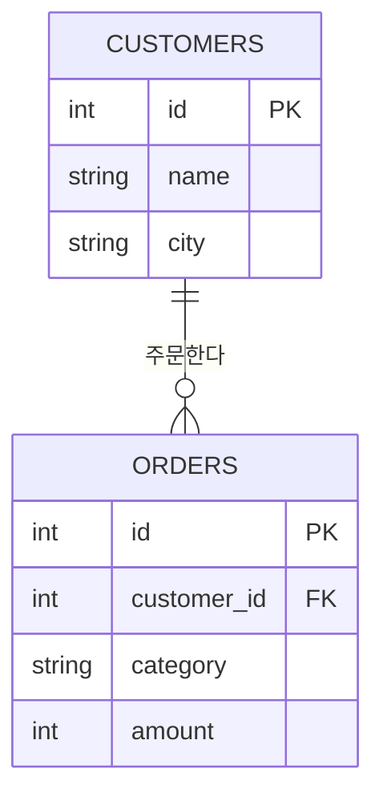

# 모듈 10 — SQL 기초

> **포커스**: 관계형 DB 개념, SELECT / WHERE / ORDER BY, JOIN, GROUP BY
> **예상 기간**: 1주
> **선행 모듈**: 09 파일 & 데이터 포맷

> 📖 **처음 보는 용어가 있나요?** 이 과정에서 쓰는 핵심 용어는 [용어집](../../../glossary.md)에 정리해 두었습니다. 막히는 단어가 나오면 먼저 찾아보세요.

세상의 데이터는 대부분 **데이터베이스** 안에 살고 있습니다. 그리고 그 데이터에게 질문을 던지고 원하는 답을 꺼내 오는 공용어가 바로 **SQL(Structured Query Language)**입니다. 데이터 엔지니어에게 SQL은 Python만큼이나, 어쩌면 그 이상으로 중요합니다. 파이프라인이 데이터를 옮기는 일의 양 끝에는 거의 언제나 SQL이 있기 때문입니다.

SQL의 매력은, 한국어 문장과 놀랄 만큼 닮았다는 점입니다. "orders에서 amount가 만 원 넘는 것을 금액 큰 순으로 보여 줘"라는 말이 거의 그대로 코드가 됩니다. 이 모듈에서는 처음부터 실무에서 가장 널리 쓰이는 데이터베이스인 **PostgreSQL**로 SELECT부터 JOIN까지 손에 익힙니다. 가벼운 학습용 DB가 아니라 현업에서 쓰는 바로 그 데이터베이스로 시작하므로, 여기서 익힌 감각이 그대로 실무로 이어집니다.

> ⚙️ **시작 전 준비**: 로컬에 PostgreSQL을 설치하고 Python 드라이버를 준비해야 합니다. [PostgreSQL 설치 & 접속 세팅](../../../../setup/postgresql-setup.md)을 먼저 따라 하세요(운영체제별 설치 + `pip install psycopg2-binary`). 같은 PostgreSQL을 모듈 12에서는 Docker 컨테이너로 띄워 봅니다.

---

## 🎯 이 모듈을 마치면

테이블·기본키·외래키 같은 관계형 데이터베이스의 기본 개념을 이해하고, `SELECT`로 원하는 데이터를 조회하며, `WHERE`로 조건을 걸고 `ORDER BY`로 정렬하며, `JOIN`으로 흩어진 테이블을 이어 붙이고, `GROUP BY`로 그룹별 통계를 낼 수 있게 됩니다. 데이터에게 던지는 대부분의 일상적인 질문을 SQL로 표현할 수 있는 상태가 됩니다.

---

## 📚 본문

### 관계형 데이터베이스 — 표들이 관계를 맺는 세계

관계형 데이터베이스는 데이터를 여러 개의 **테이블(표)**에 나누어 담습니다. 각 테이블은 행(row)과 열(column)로 이루어진, 우리가 엑셀에서 보던 바로 그 표입니다. 한 테이블은 보통 하나의 대상을 다룹니다. 예를 들어 `customers` 테이블은 고객을, `orders` 테이블은 주문을 담지요.

그런데 왜 "관계형"일까요? 핵심은 테이블끼리 **관계**를 맺는 데 있습니다. 각 행을 유일하게 식별하는 열을 **기본키(Primary Key)**라 하는데, 보통 `id`가 그 역할을 합니다. 그리고 한 테이블이 다른 테이블의 기본키를 가리키는 열을 **외래키(Foreign Key)**라 합니다. 아래에서 `orders.customer_id`는 "이 주문이 어느 고객의 것인지"를 `customers.id`를 가리켜 알려 줍니다. 이렇게 데이터를 잘게 나눠 담고 키로 연결하면, 같은 정보를 중복 저장하지 않으면서도 필요할 때 이어 붙여 볼 수 있습니다.

```
customers(id, name, city)
orders(id, customer_id, category, amount)   -- customer_id가 customers.id를 가리킨다
```

이 관계를 그림으로 보면 한눈에 들어옵니다. 한 명의 고객(`customers`)이 여러 개의 주문(`orders`)을 가질 수 있고, 각 주문은 외래키로 자기 주인을 가리킵니다.



### SELECT — 데이터를 꺼내 오는 첫걸음

모든 조회는 `SELECT`로 시작합니다. 어떤 열을 볼지 적고, `FROM` 뒤에 어느 테이블에서 가져올지 적습니다. 모든 열을 보려면 `*`를, 특정 열만 보려면 열 이름을 나열합니다. 중복을 걷어 내고 싶을 때는 `DISTINCT`를 붙입니다.

```sql
SELECT * FROM customers;                 -- 모든 열
SELECT name, city FROM customers;        -- 원하는 열만
SELECT DISTINCT city FROM customers;     -- 중복 없는 도시 목록
```

### WHERE — 원하는 행만 골라내기

테이블 전체가 아니라 조건에 맞는 행만 보고 싶을 때 `WHERE`를 씁니다. 비교 연산(`=`, `!=`, `<`, `>=` 등)과 논리 연산(`AND`, `OR`)을 조합하며, 범위는 `BETWEEN`, 목록은 `IN`, 글자 패턴은 `LIKE`로 표현합니다. 문자열 값은 작은따옴표로 감싸는 것을 잊지 마세요.

```sql
SELECT * FROM orders WHERE amount >= 10000;
SELECT * FROM orders WHERE category = 'book' AND amount < 20000;
SELECT * FROM orders WHERE amount BETWEEN 5000 AND 15000;
SELECT * FROM customers WHERE city IN ('Seoul', 'Busan');
SELECT * FROM customers WHERE name LIKE '김%';   -- '김'으로 시작하는 이름
```

여기서 잠깐, 데이터에는 "값이 비어 있음"을 뜻하는 **NULL**이 있습니다. NULL은 0이나 빈 문자열과 다르며, `= NULL`로는 비교되지 않고 `IS NULL` / `IS NOT NULL`로 다뤄야 한다는 점만 기억해 두세요(자세히는 다음 모듈에서).

### ORDER BY와 LIMIT — 정렬하고 추리기

조회 결과의 순서를 정하려면 `ORDER BY`를 씁니다. 기본은 오름차순이고, 내림차순은 `DESC`를 붙입니다. 여러 기준으로 정렬할 수도 있고, 상위 몇 건만 보고 싶으면 `LIMIT`으로 잘라냅니다. "가장 비싼 주문 3건"처럼 순위를 뽑을 때 이 둘을 함께 씁니다.

```sql
SELECT id, amount FROM orders ORDER BY amount DESC;        -- 금액 내림차순
SELECT * FROM orders ORDER BY category, amount;            -- 카테고리 → 금액 순
SELECT id, amount FROM orders ORDER BY amount DESC LIMIT 3;-- 상위 3건
```

### JOIN — 흩어진 테이블을 이어 붙이기

데이터를 여러 테이블에 나눠 담았으니, 다시 합쳐 봐야 할 때가 옵니다. "각 주문에 그 주문을 한 고객의 이름을 붙여서 보고 싶다" 같은 요구지요. 이때 외래키를 기준으로 두 테이블을 잇는 것이 **JOIN**입니다.

```sql
SELECT o.id, c.name, o.category, o.amount
FROM orders o
JOIN customers c ON o.customer_id = c.id;
```

여기서 `o`와 `c`는 테이블에 붙인 짧은 별명(alias)으로, 긴 이름을 반복하지 않게 해 줍니다. `ON` 뒤에는 **어느 열로 이을지**를 적는데, 이 연결 조건을 빠뜨리면 모든 행이 서로 곱해지는 엉뚱한 결과(카티전 곱)가 나오니 주의해야 합니다. 기본형인 `INNER JOIN`(그냥 `JOIN`)은 양쪽에 모두 짝이 있는 행만 보여 주고, `LEFT JOIN`은 왼쪽 테이블의 행을 모두 살리되 짝이 없으면 오른쪽 자리를 NULL로 채웁니다. "주문이 하나도 없는 고객까지 보고 싶다" 같은 질문에는 `LEFT JOIN`이 답입니다.

### GROUP BY — 그룹으로 묶어 통계 내기

데이터를 하나하나가 아니라 무리 지어 보고 싶을 때가 있습니다. "카테고리별 매출 합계", "도시별 고객 수"처럼요. 이때 `GROUP BY`로 같은 값끼리 묶고, 집계 함수(`COUNT`, `SUM`, `AVG`, `MIN`, `MAX`)로 각 무리의 통계를 냅니다. 계산된 값에는 `AS`로 이름을 붙여 두면 결과를 읽기 쉽습니다.

```sql
SELECT category, SUM(amount) AS total, COUNT(*) AS cnt
FROM orders
GROUP BY category
ORDER BY total DESC;
```

### SQL이 실행되는 순서

마지막으로, 입문자가 두고두고 헷갈리는 지점을 미리 풀고 갑시다. 우리가 SQL을 **쓰는** 순서(`SELECT → FROM → WHERE → GROUP BY → ORDER BY`)와 데이터베이스가 실제로 **실행하는** 순서는 다릅니다. 실제로는 `FROM`으로 테이블을 정하고 → `WHERE`로 행을 거른 뒤 → `GROUP BY`로 묶고 → `SELECT`로 열을 고른 다음 → `ORDER BY`로 정렬합니다. 이 순서를 알면 "왜 `SELECT`에서 붙인 별명을 `WHERE`에서는 못 쓰지?" 같은 의문이 자연스럽게 풀립니다. `WHERE`가 실행될 때는 아직 `SELECT`가 실행되기 전이라 그 별명이 존재하지 않기 때문입니다.

---

## 🛠 실습으로 익히기

`exercises/`에서 고객·주문이 담긴 PostgreSQL 데이터베이스를 상대로, 질문에 답하는 SQL 쿼리를 직접 작성합니다. 조건으로 주문을 추리고, 금액순으로 정렬하고, 고객과 주문을 JOIN하고, 카테고리별로 집계하는 여섯 개의 질문(Q1~Q6)이 준비되어 있습니다. 각 쿼리를 `queries.py`에 채워 넣으면 `check.py`가 실제 데이터베이스에 그 쿼리를 실행해 정답과 대조해 줍니다. 먼저 `examples/demo.py`를 실행해 각 문법이 어떤 결과를 내는지 눈으로 확인하고 시작하면 좋습니다.

---

## ✅ 완료 기준 (체크리스트)
- [ ] 테이블·기본키·외래키와 "관계"의 의미를 설명할 수 있다
- [ ] `WHERE`로 다양한 조건(비교/범위/목록/패턴)을 걸 수 있다
- [ ] `ORDER BY`와 `LIMIT`으로 정렬·상위 N건을 뽑을 수 있다
- [ ] 두 테이블을 `JOIN`으로 이어 조회할 수 있다 (INNER/LEFT 구분)
- [ ] `GROUP BY`로 그룹별 합계/개수를 구할 수 있다
- [ ] SQL의 작성 순서와 실행 순서가 다름을 이해한다
- [ ] `exercises/`의 `queries.py`가 `check.py`를 통과한다
- [ ] `assessment/quiz.md`를 모두 풀었다

## 📂 폴더 구성
- `examples/` — PostgreSQL에 스키마를 적재하고 쿼리를 실행하는 예제 (`schema.sql`, `demo.py`)
- `exercises/starter/` — 채워야 할 쿼리 골격 + 자가 검증
- `exercises/solution/` — 정답 쿼리
- `assessment/` — 퀴즈 + 완료 체크리스트

## 🔗 참고 자료
- [SQLBolt — 인터랙티브 SQL 연습](https://sqlbolt.com/)
- [PostgreSQL 공식 문서 — SQL 명령](https://www.postgresql.org/docs/current/sql-commands.html)
- [PostgreSQL 설치 & 접속 세팅](../../../../setup/postgresql-setup.md)
- [Mode SQL 튜토리얼](https://mode.com/sql-tutorial/)
- 다음 모듈 11(SQL 활용 — 집계 심화·서브쿼리)로 이어집니다.
