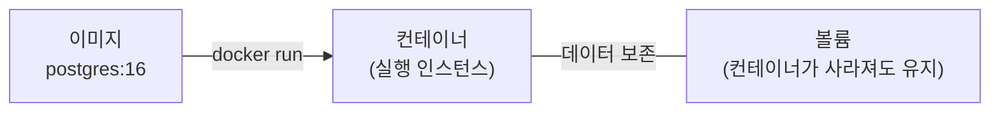

# 모듈 12 — Docker 기초

> **포커스**: 컨테이너 개념, 이미지/볼륨, `docker run`·compose, Postgres 띄우기
> **예상 기간**: 1주
> **선행 모듈**: 05 Linux, 10\~11 SQL

> 📖 **처음 보는 용어가 있나요?** 이 과정에서 쓰는 핵심 용어는 [용어집](../../../glossary.md)에 정리해 두었습니다. 막히는 단어가 나오면 먼저 찾아보세요.

"제 컴퓨터에선 됐는데요?" 개발 현장에서 가장 많이 듣는 변명이자, 가장 큰 골칫거리입니다. 같은 코드라도 누구의 컴퓨터냐에 따라 깔린 프로그램과 버전이 달라 동작이 갈리기 때문이지요. **Docker**는 바로 이 문제를 푸는 도구입니다. 프로그램과 그것이 필요로 하는 모든 것을 **컨테이너**라는 격리된 상자에 함께 담아, 어느 컴퓨터에서든 똑같이 돌아가게 만듭니다.

데이터 엔지니어는 데이터베이스, 워크플로우 도구(Airflow), 메시지 시스템(Kafka) 같은 것들을 거의 항상 컨테이너로 띄웁니다. 이 모듈에서는 모듈 10·11에서 로컬에 설치해 쓰던 PostgreSQL을, 이번엔 **컨테이너로 띄운 PostgreSQL**에서 똑같이 실행해 봅니다. 실습에는 Docker Desktop(또는 Docker Engine)이 필요합니다.

---

## 🎯 이 모듈을 마치면

이미지·컨테이너·볼륨의 차이를 이해하고, `docker` 기본 명령으로 컨테이너를 다루며, `docker compose`로 PostgreSQL을 한 번에 띄우고, 그 안에 접속해 SQL을 실행하고, 볼륨으로 데이터를 보존하는 이유를 설명할 수 있게 됩니다.

---

## 📚 본문

### 왜 Docker인가 — 세 가지 개념

Docker를 이해하려면 세 단어를 구분해야 합니다. **이미지(image)**는 실행에 필요한 모든 것을 담은 "설치 패키지"입니다. 예컨대 `postgres:16`은 PostgreSQL이 통째로 들어 있는 이미지지요. 이 이미지를 실제로 실행한 것이 **컨테이너(container)**로, 격리된 채 돌아가는 하나의 인스턴스입니다. 같은 이미지로 여러 컨테이너를 띄울 수도 있습니다. 마지막으로 **볼륨(volume)**은 컨테이너가 사라져도 **데이터를 보존**해 주는 별도의 저장소입니다.

세 개념의 관계를 그림으로 보면 이렇습니다. 하나의 이미지에서 컨테이너가 실행되고, 컨테이너의 데이터는 볼륨에 보존됩니다.



가상머신(VM)과 비교하면 Docker의 장점이 분명해집니다. VM은 운영체제를 통째로 복제해 무겁지만, 컨테이너는 호스트의 커널을 공유해 훨씬 가볍고 빠르게 뜨고 집니다. 그래서 수십 개의 서비스를 손쉽게 띄웠다 내릴 수 있습니다.

### 기본 명령

컨테이너를 다루는 명령은 Linux 명령과 결이 비슷합니다. 실행 중인 컨테이너를 보고(`ps`), 로그를 읽고(`logs`), 안으로 들어가고(`exec`), 멈추는(`stop`) 식입니다.

```bash
docker run hello-world             # 첫 컨테이너 실행 (이미지 자동 다운로드)
docker ps                          # 실행 중인 컨테이너 목록
docker logs <컨테이너>              # 로그 보기
docker exec -it <컨테이너> bash     # 컨테이너 안으로 들어가기
docker stop <컨테이너>              # 정지
```

### compose — 선언적으로 띄우기

`docker run`에 옵션을 길게 붙이는 방식은 금세 번거로워집니다. 그래서 실무에서는 띄울 서비스의 구성을 `docker-compose.yml` 파일에 적어 두고, 한 줄로 실행합니다. 무엇을(이미지), 어떤 환경에서(환경변수), 어느 포트로(포트 매핑), 데이터를 어디에 보존할지(볼륨)를 한눈에 정의하지요.

```yaml
services:
  db:
    image: postgres:16
    environment:
      POSTGRES_PASSWORD: secret
      POSTGRES_DB: shop
    ports:
      - "5432:5432"
    volumes:
      - pgdata:/var/lib/postgresql/data   # 데이터 영속화

volumes:
  pgdata:
```

```bash
docker compose up -d      # 백그라운드로 띄우기
docker compose ps         # 상태 확인
docker compose down       # 정지 + 컨테이너 제거 (볼륨은 유지)
```

여기서 포트 매핑 `"5432:5432"`는 "내 컴퓨터의 5432 포트로 들어온 요청을 컨테이너의 5432로 전달하라"는 뜻입니다. 앞이 호스트, 뒤가 컨테이너입니다.

### 컨테이너 안의 PostgreSQL에 접속하기

컨테이너를 띄웠으면, 그 안의 `psql`로 들어가 SQL을 실행할 수 있습니다. 놀랍게도(혹은 당연하게도) SQLite에서 배운 SQL이 거의 그대로 동작합니다. 달라진 것은 "어디서 도는가"일 뿐, 언어는 같습니다.

```bash
docker compose exec db psql -U postgres -d shop
```
```sql
CREATE TABLE t (id INT, name TEXT);
INSERT INTO t VALUES (1, 'hello');
SELECT * FROM t;
```

### 볼륨 — 데이터를 지키는 안전장치

여기서 초보자가 자주 데이는 지점이 있습니다. 볼륨 없이 띄운 컨테이너를 지우면, 그 안에 쌓인 데이터도 함께 사라집니다. 그래서 데이터베이스처럼 데이터를 보존해야 하는 컨테이너는 반드시 데이터 디렉토리를 **볼륨에 연결**해 둡니다. 그러면 `docker compose down`으로 컨테이너를 지웠다가 다시 `up` 해도 데이터가 그대로 남아 있습니다. 반대로 데이터까지 깨끗이 지우고 싶을 때만 `down -v`로 볼륨째 제거합니다.

---

## 🛠 실습으로 익히기

`exercises/`에서 `docker-compose.yml`을 완성해 PostgreSQL을 띄우고, `init.sql`로 테이블이 자동 생성되게 만듭니다. 이미지·환경변수·포트·볼륨·초기화 스크립트 마운트를 채워 넣는 것이 과제입니다. Docker 데몬 없이도 `docker compose config`로 파일 문법이 올바른지 먼저 검증할 수 있고(또는 `check.sh` 실행), Docker가 설치돼 있다면 실제로 띄워 `products` 테이블을 조회해 보세요. `examples/`의 동작하는 compose 예시가 좋은 출발점입니다.

---

## ✅ 완료 기준 (체크리스트)
- [ ] 이미지·컨테이너·볼륨의 차이를 설명할 수 있다
- [ ] `docker ps`, `logs`, `exec`, `stop`을 사용할 수 있다
- [ ] `docker compose up -d`로 PostgreSQL을 띄웠다
- [ ] 컨테이너의 psql에 접속해 SQL을 실행했다
- [ ] 볼륨이 데이터 영속화에 왜 필요한지 설명할 수 있다
- [ ] `exercises/`의 `docker-compose.yml`이 `docker compose config`를 통과한다
- [ ] `assessment/quiz.md`를 모두 풀었다

## 📂 폴더 구성
- `examples/` — 동작하는 compose 예시 + 접속 가이드
- `exercises/starter/` — 완성할 compose/init 골격 + 검증 스크립트
- `exercises/solution/` — 정답
- `assessment/` — 퀴즈 + 완료 체크리스트

## 🔗 참고 자료
- [Docker 공식 — Get started](https://docs.docker.com/get-started/)
- [Postgres 이미지 문서](https://hub.docker.com/_/postgres)
- [Play with Docker (브라우저 실습)](https://labs.play-with-docker.com/)
- 졸업생 트랙 모듈 01(환경)·07(오케스트레이션)에서 컨테이너를 본격 활용합니다.
