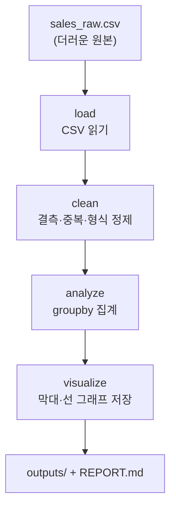

# 모듈 15 — 미니 프로젝트 (캡스톤)

> **포커스**: 수집 → 정제 → 분석 → 시각화 → 발표 (전 과정 종합)
> **예상 기간**: 1\~2주
> **선행 모듈**: 03\~14 전부

> 📖 **처음 보는 용어가 있나요?** 이 과정에서 쓰는 핵심 용어는 [용어집](../../../glossary.md)에 정리해 두었습니다. 막히는 단어가 나오면 먼저 찾아보세요.

드디어 마지막 모듈입니다. 지금까지 따로따로 배운 모든 것 — Linux, Git, Python, SQL, pandas, EDA — 을 하나의 작은 프로젝트로 묶을 차례입니다. 더러운 원본 데이터를 받아 깨끗하게 정제하고, 분석해서 답을 찾고, 그 결과를 차트와 리포트로 발표하는 — 데이터 엔지니어의 전형적인 작업 흐름을 처음부터 끝까지 직접 경험합니다. 그동안 조각으로 익힌 도구들이 하나의 흐름으로 맞물리는 순간을, 이 프로젝트에서 만나게 될 것입니다.

> 🎯 이 프로젝트의 결과물은 그대로 **포트폴리오**가 됩니다(모듈 01의 "기록의 힘"과 연결). GitHub에 깔끔한 커밋 이력과 함께 남기세요.

---

## 🎯 이 모듈을 마치면

더러운 실제 데이터를 정제 파이프라인으로 처리하고, 스스로 분석 질문을 세워 데이터로 답하며, 그 결과를 차트와 리포트로 전달하고, 전 과정을 Git으로 관리해 발표할 수 있게 됩니다. 한마디로, 데이터 엔지니어가 하는 일의 축소판을 혼자 힘으로 완주하게 됩니다.

---

## 📦 프로젝트 개요

주제는 **"동네 가게 판매 데이터 분석"**입니다. 가상의 매장 판매 기록이 `data/sales_raw.csv`로 주어지는데, 이 데이터는 현실의 데이터가 으레 그렇듯 지저분합니다. 빈 칸(결측치)이 있고, 대소문자와 앞뒤 공백이 들쭉날쭉하며, 숫자여야 할 자리에 잘못된 값이 들어가 있고, 똑같은 행이 중복되어 있기도 합니다. 이 원본을 깨끗하게 다듬는 것에서 프로젝트가 시작됩니다.

분석할 질문은 다음과 같은 것들입니다(여기서 멈추지 말고 자유롭게 넓혀도 좋습니다). 어떤 상품 카테고리의 매출이 가장 높은가? 날짜별 매출 추이는 어떤가? 결제수단(`payment`)별 비중은 어떻게 되는가? 그리고 원본의 데이터 품질 문제는 무엇이었고 그것을 어떻게 처리했는가?

작업은 네 단계의 파이프라인으로 흐릅니다. 원본을 읽어 들이고(load), 결측·중복·형식을 정제하고 타입을 바꾸고(clean), `groupby`로 집계해 질문에 답하고(analyze), 그 결과를 그래프로 저장합니다(visualize). 이 흐름 자체가 데이터 엔지니어링의 핵심 골격입니다.

---

## 🛠 무엇을 만들어 내야 하나

`exercises/`의 골격을 채워 다섯 가지 산출물을 완성합니다. 첫째, load·clean·analyze 함수를 구현한 **`pipeline.py`**입니다(`check.py`가 핵심 로직을 검증해 줍니다). 둘째, 어떤 더러운 데이터를 어떻게 고쳤는지 기록한 **정제 메모**입니다. 셋째, 카테고리별 또는 날짜별 매출을 보여 주는 **차트 한 개 이상**(matplotlib)입니다. 넷째, 분석 질문에 대한 답과 발견한 사실, 데이터 품질 메모를 담은 **`REPORT.md`**입니다. 다섯째, "무엇을 했고 무엇을 알아냈는지"를 5분 남짓으로 나누는 **발표**입니다.

여기서 가장 중요한 것은 화려한 결과가 아니라, **정제 규칙을 왜 그렇게 정했는지에 대한 자신의 판단**을 리포트에 남기는 것입니다. 그 판단의 흔적이 곧 여러분이 단순한 코드 실행자가 아니라 데이터를 다루는 사람임을 보여 줍니다.

---

## ✅ 완료 기준 (체크리스트)
- [ ] 원본의 데이터 품질 문제를 3가지 이상 찾아 정제했다
- [ ] `pipeline.py`가 `check.py`를 통과한다
- [ ] 분석 질문에 데이터로 답했다
- [ ] 차트를 1개 이상 생성했다
- [ ] `REPORT.md`를 작성했다
- [ ] Git 브랜치 + PR로 작업하고 커밋 이력이 깔끔하다
- [ ] 발표를 완료했다

## 📂 폴더 구성
- `data/` — 원본 데이터(`sales_raw.csv`)
- `exercises/starter/` — 파이프라인 골격(TODO) + 자가 검증 + REPORT 템플릿
- `exercises/solution/` — 참고 구현(엔드투엔드 동작) + 예시 리포트
- `assessment/` — 평가 루브릭 + 발표 체크리스트

## 🔗 참고 자료 / 다음 단계
- [공공데이터포털](https://www.data.go.kr/) — 실제 데이터로 확장해 보기
- 졸업생 트랙 모듈 05\~06(ETL·파이프라인 코드화)이 이 흐름의 실무 확장판입니다.
- 모듈 01에서 세운 **개인 성장 계획서**를 다시 꺼내, 처음의 다짐을 돌아보며 마무리하세요.
